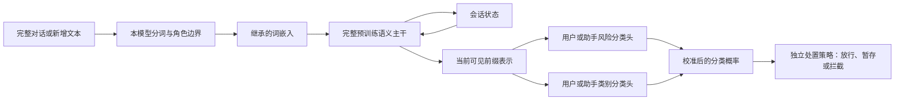

# 当前执行计划：继承语义主干，改造成高效流式分类器

**本页后续已由[第四轮风险驱动训练](../round4/README.md)推进：20,000 条公开参考 + 8,192 条同词弱标签 + 4,096 条 benign rubric + 1,023 条长背景训练样本；教师相似度不再用于选模。L20 正在运行三组候选及分类 RL 流水线。下文保留第三轮的设计与实验记录，不能把其小样本失败当成路线被否定。**

更新：2026-09-23。本文件是当前执行顺序；历史裁剪、从零预训练与 LoRA 方案保留为对照，不代表同时开展。数据生产 v12 和对外分类 Schema 均不在本次修改。

## 目标和边界

继承已有小模型的语言理解权重，训练我们自己的风险与类别读出，并研究降低长历史处理成本的网络结构。模型消费用户/助手对话，返回分类概率，不生成答案 token。完整输入与流式输入使用同一套权重；完整输入是一次处理全部输入，流式输入保存状态并处理新增内容。

LoRA 只是参数更新方法；它不能自动改变注意力结构，也不是流式分类能力的来源。原版 Qwen3Guard-Stream 已有流式因果主干和直接分类头，不能把这些说成我们新发明的能力。当前主线采用分类头预热、随后主干与分类头联合全参数后训练；LoRA 仅在明确指定 `--training-mode lora` 时作为对照运行。

## 目标结构和独立对照



- **A0：**原版 Qwen3Guard-Stream-0.6B，保留为质量与速度锚点及首轮教师。
- **Qwen3-0.6B-Base：**完整 28 层 + 新分类头，验证继承语义能力后的分类学习。
- **H24：**Qwen3.5-0.8B-Base 完整文本主干 + 新分类头，18 层 Gated DeltaNet、6 层全注意力。文本主干 752,393,024 参数；本次实现使用两个角色各自的投影，分类头 1,063,447 参数，合计 753,456,471。此前共享投影提案的头参数预算不同，不应混用。
- **Llama-3.2-1B：**保留在底座对照中，当前官方权重访问授权未满足，未开始实验。

H24 是优先研究的结构候选，不能在对照结果出来前称它质量最佳。其 GDN 层在增量推理中更新固定大小的状态；6 层全注意力的历史 KV 仍增长。后续 **H24-W** 才把这 6 层逐步迁移到有限窗口，并恢复长程语义能力。需要真实稀疏/窗口内核，不能靠稠密 mask 声称加速。

**H24-M4** 单独研究最后 6 层 FFN 的四专家上采样；总参数约 0.95B。MoE 用于增加容量，Top-1 不自动比原稠密 FFN 更快；只有容量收益大于路由成本且测试过线时才保留。W 与 M4 先分别实验，再考虑组合。纯循环 R24 从零预训练留作后续路线，目前不启动大规模预训练。

## 执行顺序与验收

| 步骤 | 实际工作 | 进入下一步的条件 |
|---|---|---|
| 1. 固定对照 | 固定权重版本、原始标签映射、训练/开发/测试、A0 教师与基线 | 文件散列一致；测试不入训；明确来源标签不等于项目金标 |
| 2. 完整主干分类学习 | 新 MLP 分类头先预热，再解冻全部文本主干联合训练；A0 提供同可见前缀软目标 | L20 全参反向有限；全量/分块数值一致；独立分类质量有可用学习信号 |
| 3. 结构改造和恢复 | H24-W 改窗口与缓存；H24-M4 改 FFN/路由，分别继续训练与蒸馏 | 长程指代/引用/否定/多轮风险不出现不可接受退化；真实 L20 效率改善 |
| 4. 项目政策后训练 | 加入经过质检、映射的词库语境数据、自然对话及反例；联合训练分类器 | 独立项目金标上的误报、漏报、校准及分组结果过线 |
| 5. 分类/流式 RL | 分类动作成本优化与流式处置策略实验；必要时小学习率联合更新主干 | 优于相同分类器的代价敏感训练、最佳静态阈值/防抖策略；不能仅总 reward 上升 |
| 6. 推理交付 | L20 内核、连续批处理、状态复用、量化消融和服务压测 | 质量门槛不退，ITPS/延迟/状态显存达到实际负载目标 |

第 2 步是为了得到网络改造前的可用起点和对照，不是宣称目标网络已经完成。第 3 步不需要等待整个合成数据集。最终政策对齐和可信 RL 奖励依赖标注与政策依据，不能用敏感词命中代替意图判断。

## 这一轮真实运行规格

`l20/base_compare/train_base.py` 默认 `full`：FP32 可训练主干参数与 Adam 状态、BF16 前向、梯度检查点；前 64 步仅更新分类头，之后更新主干和分类头。第一轮最多 1,280 个 batch、batch size 4，是学习与兼容性探针，不宣称充分收敛。

冻结数据：4,096 个公开来源训练样本，另派生 1,024 个前缀；开发集 512、独立来源测试 1,112、官方冻结子集 250。中文覆盖用户和助手，英文当前只覆盖助手监督标签，不能声称完整中英双角色覆盖。官方子集先做完整输入读出，不能冒充官方流式定位评测。

当前损失是有标签完整样本的风险交叉熵 + 0.3 风险教师 KL + 0.2 类别教师 KL（后者仅适用相应样本）。前缀不继承未来整句硬标签，教师只看相同可见文本。类别来自原 Qwen 单选头，尚不是新的项目多标签体系。训练中学习率、冻结状态、实际 token 数、权重散列均留档。

更改训练方式不更改生成记录格式。结构改造尚未写入这个底座训练脚本；其 setup 明确标记原 token-mixing 层保留。

## RL 怎么做

分类器可以做 RL，但不能指望 RL 凭空补足语言理解。对固定输入的几个类别，如果所有动作的成本都已知，直接最小化 `sum_a p(a|x) * cost(a,y)` 就能计算期望代价，比采样类别的策略梯度方差低。两者作为同预算消融，不能仅因用了 RL 就认为更好。

流式处置有真正的序列后果：放行会释放文本、暂存会增加等待、拦截会结束当前流。策略只读当前前缀和分类状态。奖励：

```text
R = -(误拦成本 + 漏放成本 + 实际泄露的风险内容成本
      + 风险证据出现后的发现延迟 + 正常内容暂存等待
      + 最终无结论成本) - 参考策略 KL 惩罚
```

不以“越早拦截越好”奖励未出现证据的前缀；未标注证据起点的样本不能用于此项。固定架构下各动作计算量近似一样，给 reward 加常数算力项不会使网络提速；计算效率由结构、内核、调度的对照测试验证。大教师可提供政策下的评判与软标签，但必须用独立金标检查可靠性。Aster TITO 的生成 token 轨迹不直接等于本分类器的 RL 轨迹；另存分类动作、logprob、状态和逐项奖励。

## 流式正确性与速度

现有 A0/C14 分类服务已有 KV 增量路径。H24 的有限窗口网络已实现，token-ID 的完整/分块一致性、因果性、物理缓存上界和反向传播已在 L20 验证。任意文本 chunk 的生产服务尚未实现：GDN 状态不能像 KV 那样直接裁剪，重分词需要检查点与后缀重放；还要验证任意 UTF-8 文本切法、角色边界、重试与状态隔离。

正式速度是 **完成分类的新增输入 token/s（ITPS）**、分类 P50/P95/P99、分类结果/s、每会话状态和吞吐。纯模型与含分词/队列/HTTP 的数字分开。不同 tokenizer 同时报自身输入 token 数与公共参考分词计数，避免假速度差。质量同时报告固定误报率下召回、漏报、宏 F1、校准、首次证据后的检测延迟和实际风险暴露。

## 核实状态

- 已完成：早期 A0/C14/C21 对照；裁剪模型虽然更快，质量不合格。不能作为当前最终模型。
- 已完成：本轮三款公开模型下载、数据冻结和 L20 环境主体准备。
- 已修改：训练默认从 LoRA 改为分类头预热后全参数后训练；LoRA 保留为显式可选对照。
- 已完成：A0 教师导出与基线、Qwen3 和 Qwen3.5 各 1,280 步完整主干后训练及评测。召回和误报同时上升，未证明整体优于 A0，见[完整主干对照](l20/FULL_BACKBONE_COMPARISON_REPORT.md)。
- 执行修复：首个 Job 在教师流式测速的缓存构造处失败，未开始学生训练。显式初始化普通 DynamicCache 修复后基线重跑通过；新内核的 C 编译依赖已补齐。当前 Job 为 `safety-guard-base-compare-20260923-r2`。
- 已完成：6 层有限窗口改造，保留全部 24 层和 0.753B 参数。8k 历史下，512 窗口将状态从 114.84 MiB 降为 24.83 MiB；窗口本身没有降低本次单会话延迟。短片段递归内核单独改善延迟；512 窗口有部分召回损失。见[窗口原型报告](l20/H24_WINDOW_PROBE_REPORT.md)。
- 恢复 v1 已完成但失败：W512 的独立长文本表示距离从 0.01861 增至 0.02648，部分召回下降，权重不晋升，见[失败报告](l20/H24_RECOVERY_V1_REPORT.md)。v2 已完成，在 L20 将结构恢复与来源硬标签训练分开，固定分类头、更新完整主干；统一学生/教师残差计算精度，并在第 0/32/64/96/128 步按长文本 dev 选择检查点。仍用 128 篇训练文档（291,727 token）、域名隔离的 32 篇验证文档和相同 512 个短输入，v2 不使用这些短输入的硬标签。W512 表示距离从 0.01861 降至 0.01793，但风险 KL 增加、部分召回未恢复；仍不晋升，见[v2 报告](l20/H24_RECOVERY_V2_REPORT.md)。
- 数据：Aster 用户已确认将运行并发从 40 提高到 400，原提交锁保留。先取回 50 个已完成分片、23 个来源组；20,029 条格式合格记录，其中 9,041 个词的一中一英两条均完整，共 18,082 条成对候选。全部为用户侧样本，标签仍为未验证合成标签；原 v12 格式未变。
- 收尾：本轮底座对照、窗口原型、恢复 v1/v2 的 Job 均已完成并释放 GPU；报告已取回，完整权重保存在 PVC。
- 未完成：达到质量门槛的窗口能力恢复、MoE 路由、H24 任意文本流式服务、新模型 RL、项目政策最终验收。
- 资源：172.19.1.144 上一张 L20；任务申请该节点全部 8 个 time-slice 名额。节点配置修改被 RBAC 拒绝，**没有**实际关闭 time-slicing，也没有停止他人任务。

入口：[训练脚本](l20/base_compare/train_base.py) · [锁定权重](l20/base_compare/models_lock.json) · [冻结数据](data/base_comparison_v1/manifest.json) · [结构详细设计](HYBRID_MOE_ARCHITECTURE_V2.md) · [奖励和数据依据](ARCHITECTURE_TRAINING_PLAN.md)。
