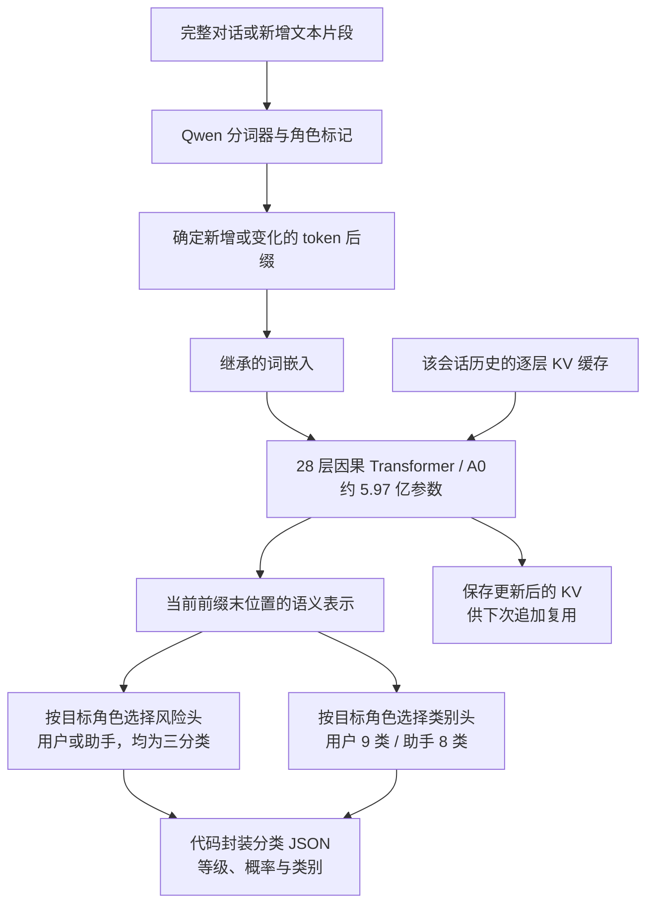
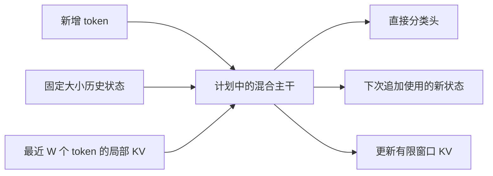

# 当前模型、已完成工作与下一步

最新执行顺序与状态见[当前执行计划](ACTIVE_EXECUTION_PLAN.md)：底座对照与目标网络改造分别验收，默认分类头预热后全参数后训练，LoRA 仅保留为对照。

最新架构方向已按用户 <1B 预算修订为[完整混合主干 + 部分层 MoE](HYBRID_MOE_ARCHITECTURE_V2.md)。12 层 H2 裁剪不再是主线。0.753B H24 已完成完整主干后训练、有限窗口实现和 L20 验证；恢复 v1/v2 的质量仍未过线。0.951B MoE 仍只完成研究及预算。下文 A0/C14 图与接口属于较早实现，最新结果以主计划和报告为准。

核对日期：2026-09-23。当前可运行的质量基线是原版 Qwen3Guard-Stream-0.6B（A0）；本项目没有从随机参数开始预训练语言主干，也尚未完成可替代 A0 的自研高速主干。自有工作主要是数据生产、结构裁剪与蒸馏实验、分类接口、流式缓存、L20 训练和评测流水线。

## 已实现的模型

原版 Guard 已经是直接分类模型，没有 LM 词表输出头；这一点来自 Qwen。我们实现了增量输入、缓存管理、角色选择、HTTP 接口和测量代码。每个 append 返回其末位置的前缀分类；单 token append 可以逐 token 返回，多 token append 当前只返回该块末位置的分类。JSON 由代码封装，不由网络逐字生成。

当前风险是 Safe / Unsafe / Controversial 三类，不应把 Controversial 当成已经校准的中等风险分数。类别是原模型的单选分布，Political 主题不自动等于不安全；本项目的政策映射和概率校准尚未完成。

## 流式效率及实际边界

历史 token 的各层 K/V 留在会话缓存，新片段到来时只对新增/变化后缀做前向。因果注意力使历史表示不依赖未来文字，因此无需重算全部历史隐藏状态。新 token 仍会关注历史 K/V：当前全注意力的计算与缓存成本仍随历史长度增长，不能称为固定状态或恒定每 token 成本。

同一分词器的精确 token-ID 接口省去全前缀分词/比较。任意文本 chunk 接口为保证 BPE 边界正确，会重新分词累计文本，再复用相同 token 前缀；必要时裁回变化后缀重算。服务目前按会话保留缓存，没有跨会话共享前缀或动态批处理；长度上限为 8192 模型输入 token。

## 已完成的训练与诊断

| 版本 | 来源和训练 | 结果 |
|---|---|---|
| A0，28 层 | 原版 Qwen3Guard-Stream-0.6B 权重 | 保留为当前质量基线，未做本项目政策对齐 |
| C14，14 层 | 继承 A0 隔层权重；L20 完成 1k pilot 与 19,776 条有效开放语料续训，后者 2,472 步 | 约 2 倍输入速度，但独立分类质量下降，不替换 A0 |
| C21，21 层 | 继承 A0 并删除 7 层，只评估了未训练初始化 | 严重漏判；尚未证明结构恢复训练后能否改善 |

C14 续训只更新 330,752 个 LoRA/风险头参数，大部分继承权重保持冻结。训练目标是对齐 A0 在同一可见前缀上的分类分布与表征，不是从零学语言，也不是已完成的 RL。教师匹配 loss 下降，但 Qwen3GuardTest 固定子集 strict F1 从 A0 的 0.819 降至 C14 的 0.603。相关报告：[Stage0](l20/STAGE0_20K_REPORT.md)、[分类与 ITPS](l20/L20_CLASSIFICATION_ITPS_REPORT.md)、[C21](l20/C21_SOURCE_PROBE_REPORT.md)。

数据侧已合并 449,575 个词，固定一词一次请求、恰好一中一英两条记录，按 33 个来源分组。全量任务已提交，并发 40；提交规模不等于已产出或通过质检的数据规模。开放中英语料已整理，独立评测集与训练来源做隔离。助手回答与多轮流式数据仍需专门覆盖，不能只靠用户单句合成集完成训练。

最新 [A0 HTTP 测试](l20/A0_HTTP_ITPS_REPORT.md)已完成。短流式追加的单客户端 P95 约 22 ms，32 客户端约 671 ms，吞吐几乎不涨，显示串行 GPU 服务是当前瓶颈；这些是短 localhost 回放，不是生产容量结论。

## 下一步顺序

1. **先优化完整 A0 的服务。** 加入跨会话小批处理、可测量的排队预算和缓存调度；保留立即分类语义及当前 Schema。用同一权重做前后对照，观察每次追加延迟、ITPS 和状态显存，避免把换输入长度当加速。
2. **实现完整预训练混合主干 H1。** 优先继承文本理解能力，在 L20 验证递归状态内核、前缀一致性和分类头训练；第一阶段保留完整层数，先不重复直接裁层。开放语料可以现在用于迁移和蒸馏，项目安全对齐继续等待相应标签。
3. **质量合格后再探索 H2。** 目标是固定递归状态层加有限窗口注意力，减少长会话缓存与访问开销；先前提议的 12 层 / 9+3 / 256 窗口均是实验参数，不是已经定型的模型。关注远距离指代、否定和风险后缀，防止有限记忆漏判。
4. **完成专用安全能力。** 按冻结格式提取和校验合成集，补助手回答、多轮与流式前缀；用可靠标签训练分类头并蒸馏，冻结政策映射和独立校准。较大的教师是否有用需同数据预算对照，不预设先训 4B 一定更优。
5. **再验证 RL。** 对流式决策的漏判、误拦和发现延迟做奖励，与监督分类加静态阈值对照。RL 不替代语言理解和分类标签，也不把模型改为生成文本答案。

这张目标图尚未实现。只有同一 L20 上分类质量、流式风险发现和 ITPS/延迟同时达到门槛，才替换 A0。全部新训练和正式性能测试继续使用 L20。
