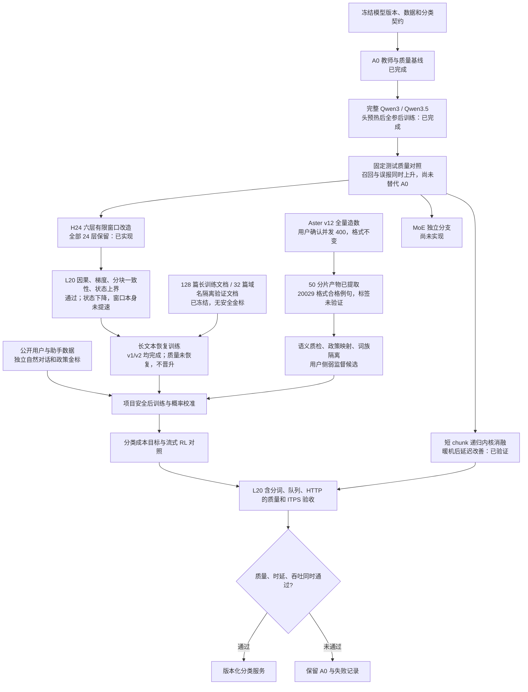

# 流式分类模型执行 DAG

**最新运行节点见[第四轮 DAG](../round4/EXECUTION_DAG.md)，主目标已转为风险标签和错误成本，教师相似度只留作历史诊断。**

更新：2026-09-23。以[当前执行计划](ACTIVE_EXECUTION_PLAN.md)和实际输出为准。所有训练与模型性能验收在 L20 执行；模型输出风险和类别概率，不生成文本 token。

- [完整主干训练报告](l20/FULL_BACKBONE_COMPARISON_REPORT.md)：两款模型均完成 1,280 步全参后训练；LoRA 未作为本轮训练方式。
- [有限窗口报告](l20/H24_WINDOW_PROBE_REPORT.md)：0.753B 参数不变；8k 历史的 512 窗口状态约 24.83 MiB；512 窗口有部分召回损失，需要恢复训练。
- [长文本恢复集](data/window_recovery_v1/manifest.json)：291,727 个训练输入 token，70,111 个验证输入 token；用途是表征/同可见前缀教师分布恢复，不是项目政策金标。
- [部分造数产物审计](../round2/oneword2_v12/partial_snapshot_50/quality_audit.json)：11,163 个词产物齐全，9,041 个词两句都合格；18,082 条成对候选全部是用户侧，助手训练仍需相应数据。
- [原始生成锁](../round2/oneword2_v12/full_run_lock.json)与[并发变更确认](../round2/oneword2_v12/runtime_overrides.json)分别保留，避免把后续运行变更回写成原提交参数。
- [历史 DAG](archive/EXECUTION_DAG_before_full_backbone.md)保留 C14/C21 实验及其质量未过线的结果；裁剪不再是主线。

尚未交付：H24 任意文本 chunk 的分词回滚服务、达到质量门槛的窗口恢复、MoE、这一版模型的 RL、独立政策金标验收及生产并发压测。已完成 token-ID 增量推理不能替代这些验收。
