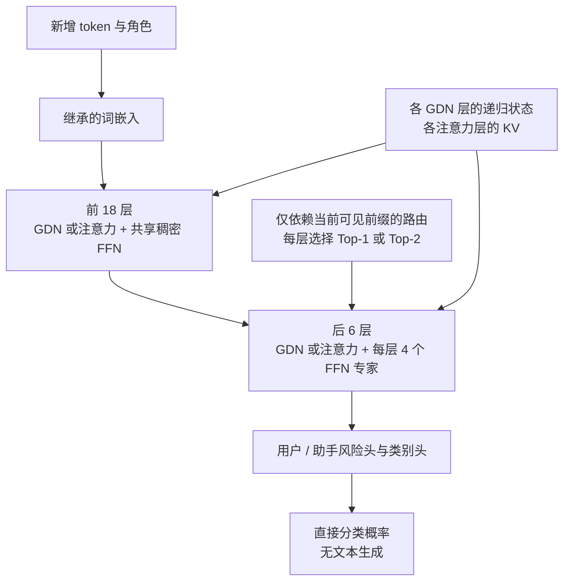

# 架构修订 v2：完整混合主干、有限历史访问与稀疏专家

当前实际执行路线见[当前执行计划](ACTIVE_EXECUTION_PLAN.md)。后续恢复到继承完整预训练主干作为主线；纯循环随机初始化 R24 保留为研究备选。H24 的分类后训练和有限窗口改造已实现并在 L20 验证；MoE 仍属于设计。

后续讨论已放开“必须继承预训练权重”的约束，新增[零 softmax 注意力的纯循环 R24 方案](PURE_RECURRENT_PRETRAIN_PLAN.md)。本文件保留为继承权重的混合对照，不能把它与从零预训练 R24 混称为已实现的同一模型。

日期：2026-09-23。状态：H24 完整主干已后训练，有限窗口已实现并验证；恢复训练未通过质量门槛，MoE 尚未实现。用户接受总参数小于 1B，并要求效率来自计算结构而非单纯删层。本版本替代把 12/14 层裁剪作为主线的旧设想；C14/C21 保留为已完成对照，A0 保持质量基线。数据生成 Schema、模型对外分类契约均不因本方案改变。

## 已实现结构与拟议改动

目前 C14/C21 的主干结构改动就是从 Qwen3Guard-Stream-0.6B 删除层，未实现稀疏注意力、递归状态或 MoE；KV 缓存和直接分类能力的结构基础来自 Qwen。LoRA 蒸馏和服务工程不是新的注意力架构。

新路线继承 Qwen3.5-0.8B-Base 的完整文本主干。官方 24 层布局为 18 个 Gated DeltaNet 与 6 个注意力层，宽度 1024；0.8B 版本的 FFN 是稠密的，不能将系列介绍中的 MoE 误认为该小型号已经使用 MoE。预训练文本能力可以继承，但 Qwen3Guard 的安审能力不会因更换基座自动继承，分类头必须训练和蒸馏。

| 版本 | 结构 | 用途 / 未验证点 |
|---|---|---|
| H24 | 全部 24 层原始混合主干 + 分类头 | 先验证完整预训练能力与 L20 内核；6 层仍有全历史 KV |
| H24-W | H24 的 6 个注意力层逐步迁移为有限窗口，先试 W=512/1024 | 以固定递归状态保留历史摘要、局部 KV 保留近处细节；有遗忘远处证据风险 |
| H24-M4 | H24 最后 6 层 FFN 改为每层 4 个专家，Top-1 / Top-2 分别训练和验收 | 隔离 MoE 的容量和路由开销，先不同时改注意力 |
| H24-W-M4 | 组合已单独通过质量门槛的 W 与 M4 改动 | 候选最终结构，不预先宣称组合收益相加 |

路由实际位于每个被替换 FFN 的输入位置，不是先读完整消息的外部领域分类服务。共享的前 18 层及所有 token-mixing 模块处理共通语义；首轮不额外加独立的 shared-expert 分支。允许以后加层，但必须证明增加的串行计算带来有价值的质量收益。

## 参数预算：由官方 tensor header 核算

来源固定为 `Qwen/Qwen3.5-0.8B-Base@dc7cdfe2ee4154fa7e30f5b51ca41bfa40174e68`。只读取公开配置和 safetensors header，没有执行本地模型推理。原始元数据见 [source_metadata](research/qwen35_08b_source_metadata.json)，可复算脚本见 [budget_h24_moe.py](research/budget_h24_moe.py)，输出见 [h24_moe_budget.json](research/h24_moe_budget.json)。

| 部分 | 参数 |
|---|---:|
| 完整 24 层文本主干，包括输入嵌入 | 752,393,024 |
| 分类头预算：共享 1024→512，再接用户/助手 3/9/3/8 维头 | 536,599 |
| H24 分类器 | **752,929,623** |
| 一个原始 FFN：3 × 1024 × 3584 | 11,010,048 |
| 6 层各从 1 个 FFN 扩为 4 个的增量 | 198,180,864 |
| 6 个无偏置路由器 | 24,576 |
| H24-M4 / H24-W-M4 预算 | **951,135,063** |

视觉塔和 MTP 不进入分类器。原模型 LM 输出与输入嵌入共享权重，取消输出运算不能再次减掉输入嵌入参数。这里的分类头大小是提案，最终按实现重新计数。

Top-1 所选路径按包含整个嵌入表的常见参数口径约 0.753B，Top-2 约 0.819B；这些数不是 FLOPs，也不是每个 token 真正读取的权重字节数。批处理中的不同 token 可调用全部专家。相对 H24，Top-1 的 FFN 主体算术量近似不变、增加路由开销，不能称作单独的加速；其价值假设是同等激活预算有更高容量。需要同时测总参数、线性层 MAC、HBM 流量与真实 L20 延迟。

## 效率来自哪里

- GDN 把历史压入固定大小的递归状态，逐输入 token 更新；理论状态成本不随历史长度增加，但有固定矩阵读写及内核成本。
- H24 原版仍有 6 层全注意力，整体不是恒定状态。H24-W 的这些层只访问有限窗口，才使主干的历史状态和每步历史访问在固定宽度/窗口下有界。窗口改变需要训练适应，不能直接截 KV 并当作等价推理。
- 按配置估算，18 层 FP32 GDN 主状态约 18 MiB；6 层、512 窗口的 BF16 KV 约 6 MiB；卷积状态约 0.84 MiB。总计约 24.84 MiB/会话，未含工作区、分词、回滚快照或分配器。短上下文未必比 A0 更省；这些只是张量预算，需 L20 实测。
- MoE 只路由 FFN，不切换整套有状态主干。若按专家切换整套循环网络，未运行专家的历史状态会过期，不适合把它作为本次简单路由方案。
- 不采用按当前安全分数跳过深层的动态早退作为第一版：后续 token 需要深层历史状态，跳过后如何补齐必须先有方案。

文本 chunk 的 BPE 后缀变化仍需处理。GDN 状态不能像 KV 一样简单 crop；实现时要有稳定分词边界和有界的状态回滚/重放方案，并计入快照复制及重算成本。不能只验证精确 token-ID 路径就声称任意文本 HTTP 已实现恒定成本。不同 chunk 切法的路由必须只依赖相同可见前缀，负载控制不得随推理批次改变决策。

## 稀疏注意力与 DeepSeek 的适用边界

NSA/DSA 的思路是减少每个 query 实际关注的位置，值得对照。但 DSA 官方实现还会对历史 index keys 评分选 Top-k，历史缓存也仍存在，因此不能将 DSA 说成总计算 O(1) 或固定缓存。索引、Top-k、gather 与内核启动成本，在本项目的小模型/短输入上可能抵消节省。

截至核查时，FlashMLA 官方高性能内核支持表主要为 SM90/SM100；不能将这些卡上的数字照搬到 L20。第一版采用更容易验证的局部窗口；DSA 风格的学习检索注意力放在独立分支，先验证 L20 内核和质量恢复成本。局部注意力也必须使用真正跳过无关块的内核，稠密矩阵加 mask 只是正确性参考，不算稀疏加速。

## 现有分类如何帮助 MoE

当前 33 类是原始来源分桶，既不互斥，也不是语义任务，不能直接对应 33 个专家。保留 `source_category` 用于追溯、采样与数据隔离；在下游派生训练清单中增加语义多标签，不改已冻结的生成记录 Schema。

语义标签可以支持领域辅助任务、混合采样、错误分析与路由暖启动。第一版仍让专家由训练分化，不承诺一个专家必然对应一个领域。数据应包含领域交叉、未知领域、中英混合与同词不同意图；推理时没有真实领域标签，只能用已经读到的前缀，不能偷看整句标签或后缀。领域路由不能自动决定风险标签。

## 继承权重和训练顺序

1. 加载完整 H24 文本主干；训练分类头并做同可见前缀蒸馏，先确认未改结构时可学会分类。新 tokenizer 与 Guard tokenizer 不同，前缀按文本/字符边界对齐，不能按相同 token 序号直接蒸馏；原始 hidden state 不同坐标系，使用经训练的投影或以分类分布蒸馏为主。
2. M4 使用 dense-to-MoE upcycling：复制对应预训练 FFN 到 4 个专家。若专家输出完全相同、组合权重和为 1，则转换的 FFN 在初始化时等价，须用数值测试核实。不能把这个等价性扩展为分类能力已合格或 router 已经会学习。
3. 路由训练必须显式解决离散选择：Top-1 若把唯一 gate 归一化为 1，分类 loss 对 router 不会有普通可导梯度。实施前冻结可训练门控/梯度估计、均衡损失与防塌缩方案，必要时用 Top-2 暖启动后做 Top-1 恢复训练；不得只复制专家、加 argmax 就宣称完成 MoE 训练。最终测速模式必须经过同模式质量评测。
4. W 单独做窗口迁移和前缀一致性训练，以长程指代、引用、否定、风险后缀及多轮依赖测试有限状态的信息损失。若必须保留全历史层才能恢复质量，则如实记录仍有增长状态成本。
5. W/M4 单独有效后再组合。最后才用最终安全数据对齐和校准；公开训练数据、语义迁移无需等待合成全集。RL 仍针对流式处置策略，不负责弥补未恢复的基础分类能力。

## 验收

每个结构与 H24、原版 A0 对照，同训练数据与预算；只使用不参与训练的独立评测。固定误报率下召回、跨域/跨来源泛化和流式发现延迟过线后，再比较输入长度 128/512/2k/8k、chunk 1/8/32、并发 1/8/32 的 ITPS、分类 P50/P95/P99、状态显存。架构更改与服务批处理分别做对照，避免把工程收益归因于网络。MoE 另报专家利用率、路由熵、批内负载、跨领域质量及路由/dispatch 耗时；推理不丢弃未能路由的 token。

## 主要来源

- [Qwen 官方模型与架构](https://huggingface.co/Qwen/Qwen3.5-0.8B-Base)
- [Transformers Qwen3.5 内核说明](https://huggingface.co/docs/transformers/main/model_doc/qwen3_5)
- [Sparse Upcycling：复用稠密预训练权重](https://arxiv.org/abs/2212.05055)
- [DeepSeek-V3：共享/路由专家与负载平衡](https://arxiv.org/html/2412.19437v2)
- [NSA 论文](https://arxiv.org/abs/2502.11089)
- [DSA 官方实现](https://github.com/deepseek-ai/DeepSeek-V3.2-Exp)
- [FlashMLA 官方硬件支持表](https://github.com/deepseek-ai/FlashMLA)
