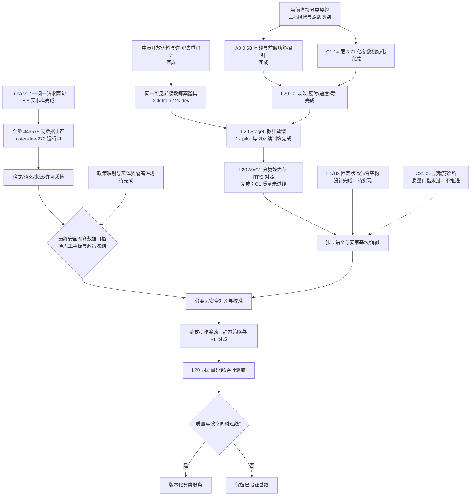

# 流式安审分类器执行 DAG

日期：2026-09-23。这里区分**无项目安全标签的开放语料蒸馏**与**最终政策安全对齐**：后者仍需要独立人工金标、政策映射和评测隔离；前者已在 L20 开始，不能把教师匹配损失解释为安审能力。

已核对的节点产物：

- [当前分类输出 Schema](guard-classification-v1.schema.json)及[流式实现](classifier_runtime.py)：每次追加输入返回三档风险与原版类别；Stage0 未校准。[目标策略输出 Schema](guard-decision-v1.schema.json)及[示例](guard-decision-v1.example.json)的证据充分、拒答和动作尚待标签与训练，不由当前 C1 伪造。
- [C1 初始化清单](checkpoints/c1_even14_init/build_manifest.json)和[L20 功能探针](l20/c1_l20_results.json)：376,878,080 参数，合成反向传播有限值；1K 上下文单路 chunk 1 / 16 各约 109.7 / 1453 token/s，仅说明未训练 C1 的该测试条件。
- [Stage0 1k L20 pilot](l20/stage0_output/summary.json)：开放语料、同可见前缀教师 KL/表征蒸馏，dev total loss 1.7076→1.3448；不使用来源或项目安全标签。[20k/2k L20 续训报告](l20/STAGE0_20K_REPORT.md)：19,776 条实际训练、1,973 条开发复评，2,472 步，dev loss 1.3504→1.0523；依然不代表项目安审能力。
- [Luna v12 固定实现](../round2/oneword2_v12/flow/pipeline.py)和[小样提取汇总](../round2/oneword2_v12/smoke/extracted/summary.json)：一词一请求，恰好一中一英，8/8 词、16/16 条结构完整。全量按 33 个真实来源类别分片，分片只是作业容器，不改变逐词调用。
- [全量 Run 冻结清单](../round2/oneword2_v12/full_run_lock.json)：数据树、Schema、prompt 与 flow 哈希，模型配置 gpt-5.6-luna，并发 40、最多尝试 1 次；Aster `aster-dev-272` 已启动。合成标签仍须语义质检与独立校准。
- [H1/H2 固定状态架构实验规格](FAST_STREAM_ARCHITECTURE.md)：继承预训练混合主干，再验证有限状态/局部 KV 是否在 L20 降低长会话成本；尚无速度结论。
- [A0/C1 L20 分类与 ITPS 报告](l20/L20_CLASSIFICATION_ITPS_REPORT.md)：C1 约 2 倍输入速率，但官方子集误报/漏判明显恶化，当前不得进入安全服务；需先恢复质量。
- [C21 来源域诊断](l20/C21_SOURCE_PROBE_REPORT.md)：21 层未训练裁剪的用户/助手 AUC 远低于 A0，预注册推进条件未过；暂保留完整 A0 为质量基线。
- [流式动作奖励模拟器](stream_reward.py)与[边界测试](test_stream_reward.py)。奖励系数和政策标签仍未冻结。

最终安全对齐的未完成项：冻结政策与来源标签映射；按实体族隔离评测、防止基准污染；为中文公共事务、真实人物、拒答与跨轮前缀制作独立仲裁标签及可判定风险起点。公开语料解决语言/语义迁移的训练输入，不自动提供我们的政策真值。
