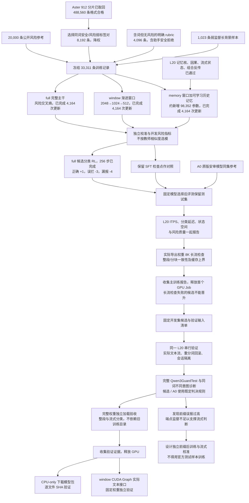

# 第四轮执行 DAG：直接优化风险识别

日期：2026-09-23。当前实际状态见 [EXECUTION_STATUS.json](EXECUTION_STATUS.json)；完成以结果文件为准，不把提交或梯度检查当作质量提升。

三组各训练 2 个 epoch，完整数据顺序和预算一致。校准集 900、开发集 1,200、保留测试 1,200；以真实风险标签上的召回、误报、PR-AUC 等衡量能力，保留每次验证曲线，不因一次小实验下降就否定路线。

分类 RL 采样的是风险判断动作，不是文本 token。其奖励来自 [rubric](rubric.json)与样本标签；生成弱标签降权，阶段内的参考策略 KL 仅限制更新幅度，不充当风险真值。此轮尚非 `allow/hold/block` 流式释放策略，也不声称生产验收完成。
