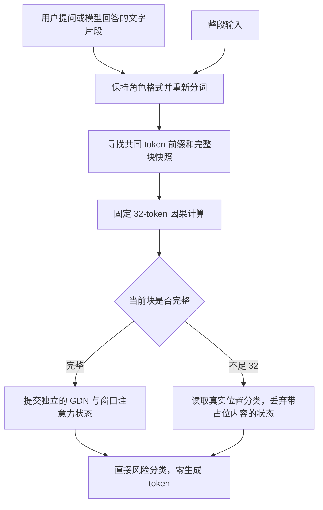

# 统一整段与流式的分类计算路径

状态：实现与验证中；未获得新引擎的 L20 验收。原始训练、数据及模型选择协议保持冻结。

原 window CUDA Graph 与同一缓存轨迹的 eager 在控制实验中状态、双头概率差均为零，但原 bulk prefill 与逐块缓存路径有数值差异。真实开发样本后缀实验出现最大概率差 0.0403082、两次目标头 argmax 翻转，超过既定 0.03 容差；固定高校准阈值没有翻转。原 `fast_text_audit.pass=false` 保留，不能把内部漂移说成不影响分类，也不放宽原容差。

新服务路径固定从第 0 个 token 起按 32-token 块计算。每个神经网络调用的序列长度总是 32；最后不足 32 的块补合法词表内的占位 token，使用正常因果计算，并读取真实位置的分类头。未来占位 token 不能影响前面的真实位置，这一点需要专门实测。模型没有词表生成头，补齐不是生成文本。

仅保存真正完成的 32-token 块所产生的缓存。末尾未完成块的最终缓存包含占位内容，必须丢弃；只保留该块之前的完整缓存及真实末位置的分类。追加文字时重新计算末块，整段入口也遵循相同顺序。因此计算形状与历史由输入前缀唯一决定，不由网络如何切分文字决定。BPE 尾部变化则恢复最长共同 token 前缀之前的完整块快照；不足时重放，不使用错误的旧状态。

18 个 GDN 层、6 个 W512 注意力层及所有已训练参数保持不变。早期不足 512 的缓存使用固定 32 的 eager 调用；窗口满后拟只捕获一个长度 32 的 CUDA Graph，输出双角色全部 32 个位置的风险概率。单个固定图有望减少原 32 个图的状态存储，但收益以新的实际结果为准。

已冻结的第五轮 SFT/RL 继续使用原评估协议选检查点。选定权重后，新服务路径单独在 calibration 集拟合 whole/stream 两组阈值，在 dev 集观测；不使用 fresh holdout、官方测试调阈值或重新挑权重。旧 bulk 参考结果与新服务结果分别报告，不能挪用旧路径的校准证据。未知英文用户组仍不填阈值。

验收须覆盖：未来占位内容不改变真实位置输出；不同到达方式与整段入口的全部可观察前缀一致；块边界、角色切换、BPE 收缩、深回滚、异常事务、会话隔离与 8192 上限；相同 32 形状的 graph/eager 对照；真实文本的分类延迟和 ITPS。ITPS 分子只计净新增用户输入，重放、占位及启动 token 分开计账。原 bulk 整段前向作为单独数值诊断保留，不把旧失败重写成通过。
