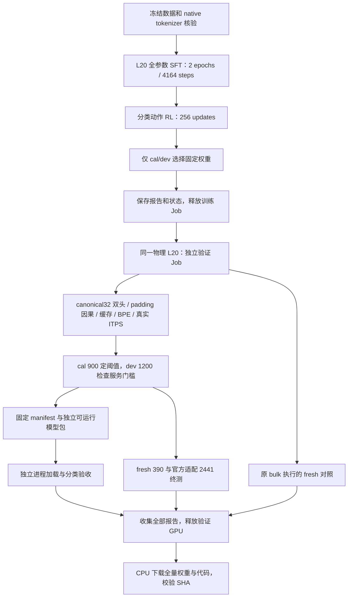

# Round5 执行路径

训练 Job 与验证 Job 串行占用同一张 L20；下载阶段不占 GPU。本机只准备数据、核验文件和汇总报告，不进行神经训练或推理。

模型保留 Qwen3.5 的 24 层文本基座，18 层 Gated DeltaNet、6 层注意力，注意力历史限制为 512 token；有用户和助手两个分类头，不生成回答 token。已有基座和上一轮权重提供初始化，本轮不是从随机参数预训练。

canonical32 固定从序列起点每 32 token 计算一块。未满一块时仅对未来位置补齐，只返回真实位置结果；带补齐的缓存不提交。文本追加或 BPE 变化时回到完整块边界重算，使整段与分批输入使用同一种计算轨迹。正确性和速度仍须 L20 实测通过，不能据设计先宣称加速。

校准只读冻结 cal；dev 检查质量门槛；fresh 和官方适配数据不参与选权重或调阈值。完整执行、数值一致、质量门槛、吞吐分别报告。质量门槛失败也保留研究产物，状态明确标注，不能当作上线批准。
